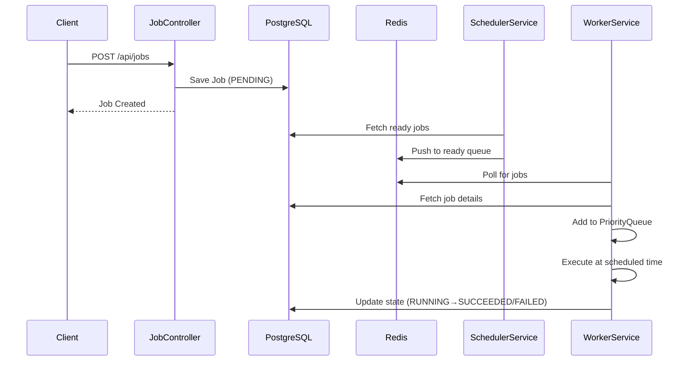

# ChronoQueue ⚡

> A distributed delayed job scheduling framework built with Spring Boot, Redis, and PostgreSQL

[](https://www.oracle.com/java/)
[](https://spring.io/projects/spring-boot)
[](https://redis.io/)
[](https://www.postgresql.org/)

## Table of Contents

- [Overview](#overview)
- [Features](#features)
- [Architecture](#architecture)
- [Technologies](#technologies)
- [Getting Started](#getting-started)
- [API Usage](#api-usage)
- [Job Lifecycle](#job-lifecycle)
- [System Design](#system-design)
- [Future Enhancements](#future-enhancements)
- [License](#license)

## Overview

ChronoQueue is a distributed job scheduling framework designed to schedule, persist, and execute background jobs reliably — even when services crash, restart, or scale. It handles delayed task execution with built-in retry mechanisms, priority-based scheduling, and fault tolerance.

**Use Cases:**
- Send emails at specific times
- Generate reports on schedules
- Trigger webhooks when data is ready
- Execute deferred tasks with priority ordering

## Features

- **🔒 Persistent Storage** - PostgreSQL ensures no job is lost, even after system crashes
- **⚡ Redis Queue** - Fast in-memory distributed queue for worker coordination
- **📊 Priority Scheduling** - In-memory PriorityQueue (min-heap) for efficient job ordering
- **🔄 Retry Mechanism** - Exponential backoff with configurable max attempts
- **🛡️ Fault Tolerance** - Automatic recovery and state tracking across restarts
- **🎯 Multiple Queue Types** - Support for different job categories (email, notifications, reports)
- **🔐 Thread-Safe Execution** - Concurrent job processing with state management

## Architecture

ChronoQueue consists of three core components:

### 1. Job Creation API
Accepts job requests via REST API and persists them to PostgreSQL.

### 2. Scheduler Service
Periodically scans for jobs ready to execute and pushes them to Redis queues.

### 3. Worker Service
Pulls jobs from Redis, maintains a priority queue in memory, and executes jobs at the scheduled time.

### System Flow



## Technologies

| Layer | Technology |
|-------|-----------|
| Backend Framework | Spring Boot 3.x (Java 17) |
| Database | PostgreSQL 15 |
| Cache/Queue | Redis 7.x |
| ORM | Spring Data JPA / Hibernate |
| Scheduler | Spring Task Scheduler |
| Serialization | Jackson |

## Getting Started

### Prerequisites

- Java 17 or higher
- PostgreSQL 15+
- Redis 7+
- Maven 3.6+

### Installation

1. **Clone the repository**
```bash
git clone https://github.com/yourusername/chronoqueue.git
cd chronoqueue
```

2. **Configure application properties**
```properties
# application.properties
spring.datasource.url=jdbc:postgresql://localhost:5432/chronoqueue
spring.datasource.username=your_username
spring.datasource.password=your_password

spring.redis.host=localhost
spring.redis.port=6379
```

3. **Build the project**
```bash
mvn clean install
```

4. **Run the application**
```bash
mvn spring-boot:run
```

## API Usage

### Create a Job

**Endpoint:** `POST /api/jobs`

**Request Body:**
```json
{
  "queueType": "EMAIL",
  "taskType": "email.send",
  "payload": {
    "userId": 42,
    "email": "user42@example.com",
    "template": "welcome"
  },
  "scheduledAt": "2025-10-22T11:30:00Z",
  "priority": 100,
  "maxAttempts": 3
}
```

**Response:**
```json
{
  "id": "550e8400-e29b-41d4-a716-446655440000",
  "state": "PENDING",
  "createdAt": "2025-10-22T10:00:00Z"
}
```

### Queue Types

- `EMAIL` - Email delivery jobs
- `NOTIFICATION` - Push notifications
- `REPORT` - Report generation
- `WEBHOOK` - External API calls

## Job Lifecycle

```
PENDING → RUNNING → SUCCEEDED
    ↓         ↓
    ↓      FAILED → RETRY → RUNNING
    ↓                ↓
    ↓              DEAD (max attempts exceeded)
    ↓
  DEAD (if skipped)
```

| State | Description |
|-------|-------------|
| `PENDING` | Job is queued and waiting to be scheduled |
| `RUNNING` | Worker is currently executing the job |
| `SUCCEEDED` | Job completed successfully |
| `FAILED` | Temporary error occurred during execution |
| `RETRY` | Job scheduled for retry with exponential backoff |
| `DEAD` | Maximum retry attempts exceeded |

## System Design

### Data Structures & Algorithms

ChronoQueue applies computer science fundamentals to solve real-world problems:

| Concept | Implementation | Benefit |
|---------|---------------|---------|
| **Priority Queue (Min-Heap)** | Orders jobs by `scheduledAt` and `priority` | O(log n) insertion and extraction |
| **Exponential Backoff** | Retry delays: 5s → 10s → 20s → 40s | Prevents system overload during failures |
| **State Machine** | Enum-based job lifecycle | Predictable state transitions |

### Design Principles

1. **Reliability First** - Every job is persisted before execution
2. **Fault Tolerance** - System recovers gracefully from crashes
3. **Decoupled Components** - Separation of concerns across services
4. **Scalability Ready** - Redis enables horizontal worker scaling
5. **Algorithm-Driven** - DSA concepts power core scheduling logic

### Component Responsibilities

```
┌─────────────────┐
│  JobController  │ ← REST API endpoint
└────────┬────────┘
         │
         ▼
┌─────────────────┐
│   JobService    │ ← Validation & persistence
└────────┬────────┘
         │
         ▼
┌─────────────────┐
│   PostgreSQL    │ ← Durable job storage
└─────────────────┘
         ▲
         │
         ▼
┌─────────────────┐
│ SchedulerService│ ← Scans & queues ready jobs
└────────┬────────┘
         │
         ▼
┌─────────────────┐
│      Redis      │ ← Fast distributed queue
└────────┬────────┘
         │
         ▼
┌─────────────────┐
│  WorkerService  │ ← Executes jobs with priority queue
└─────────────────┘
```

## Future Enhancements

- [ ] **Distributed Locks** - Support multiple worker nodes with Redis locks
- [ ] **Monitoring Dashboard** - Web UI for job tracking and metrics
- [ ] **Worker Pool Management** - Configurable concurrency limits
- [ ] **Custom Executors** - Pluggable job execution handlers
- [ ] **Cron Jobs** - Support for recurring scheduled tasks
- [ ] **Dead Letter Queue** - Advanced failure handling
- [ ] **Rate Limiting** - Per-queue execution throttling
- [ ] **Observability** - Prometheus metrics and distributed tracing

## What This Project Demonstrates

- Deep understanding of distributed systems architecture
- Practical application of data structures and algorithms
- Fault-tolerant system design patterns
- State management in distributed environments
- Experience with Spring Boot, Redis, and PostgreSQL
- Ability to build production-grade infrastructure

## Contributing

Contributions are welcome! Please feel free to submit a Pull Request.

## License

This project is licensed under the MIT License - see the [LICENSE](LICENSE) file for details.

---

**Built with ❤️ to understand how distributed job schedulers work under the hood**