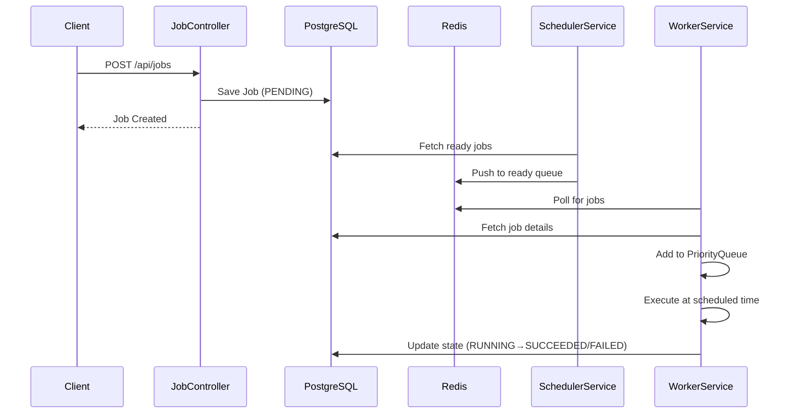

# ChronoQueue ⚡

> A learning-focused distributed delayed job scheduling framework built with Spring Boot, Redis, and PostgreSQL

[](https://www.oracle.com/java/)
[](https://spring.io/projects/spring-boot)
[](https://redis.io/)
[](https://www.postgresql.org/)

> **⚠️ Learning Project Notice:** This is an educational implementation to understand distributed job scheduling systems like Sidekiq, Celery, and Bull. It is **not production-ready** and intentionally omits certain complexities to focus on core concepts.

## Table of Contents

- [Overview](#overview)
- [Learning Objectives](#learning-objectives)
- [Features](#features)
- [Architecture](#architecture)
- [Technologies](#technologies)
- [Getting Started](#getting-started)
- [API Usage](#api-usage)
- [Job Lifecycle](#job-lifecycle)
- [System Design](#system-design)
- [Design Trade-offs](#design-trade-offs)
- [What I Learned](#what-i-learned)
- [Future Enhancements](#future-enhancements)
- [License](#license)

## Overview

ChronoQueue is a learning project that explores how distributed job scheduling frameworks work internally. It demonstrates core concepts like delayed task execution, priority-based scheduling, and fault tolerance through a simplified implementation.

**Inspired By:**
- **Sidekiq** (Ruby) - Background job processing
- **Celery** (Python) - Distributed task queue
- **Bull** (Node.js) - Redis-based queue system

**Use Cases:**
- Send emails at specific times
- Generate reports on schedules
- Trigger webhooks when data is ready
- Execute deferred tasks with priority ordering

## Learning Objectives

This project was built to deeply understand:

1. **Data Structures in Action** - How priority queues (min-heaps) enable efficient scheduling
2. **Distributed Systems** - Coordination between multiple services using Redis and PostgreSQL
3. **Fault Tolerance** - Recovery mechanisms when services crash or restart
4. **State Machines** - Managing job lifecycle transitions
5. **Retry Patterns** - Exponential backoff and failure handling
6. **Trade-offs** - Balancing simplicity vs. production requirements

## Features

- **🔒 Persistent Storage** - PostgreSQL ensures no job is lost, even after system crashes
- **⚡ Redis Queue** - Fast in-memory distributed queue for worker coordination
- **📊 Priority Scheduling** - In-memory PriorityQueue (min-heap) for efficient job ordering
- **🔄 Retry Mechanism** - Exponential backoff with configurable max attempts
- **🛡️ Fault Tolerance** - Automatic recovery and state tracking across restarts
- **🎯 Multiple Queue Types** - Support for different job categories (email, notifications, reports)
- **🧪 Lease-Based Recovery** - Detects and recovers stuck jobs using timeout mechanisms

## Architecture

ChronoQueue consists of three core components:

### 1. Job Creation API
Accepts job requests via REST API and persists them to PostgreSQL.

### 2. Scheduler Service
Periodically scans for jobs ready to execute and pushes them to Redis queues.

### 3. Worker Service
Pulls jobs from Redis, maintains a priority queue in memory, and executes jobs at the scheduled time.

### System Flow



## Technologies

| Layer | Technology |
|-------|-----------|
| Backend Framework | Spring Boot 3.x (Java 17) |
| Database | PostgreSQL 15 |
| Cache/Queue | Redis 7.x |
| ORM | Spring Data JPA / Hibernate |
| Scheduler | Spring Task Scheduler |
| Serialization | Jackson |

## Getting Started

### Prerequisites

- Java 17 or higher
- PostgreSQL 15+
- Redis 7+
- Maven 3.6+

### Installation

1. **Clone the repository**
```bash
git clone https://github.com/yourusername/chronoqueue.git
cd chronoqueue
```

2. **Configure application properties**
```properties
# application.properties
spring.datasource.url=jdbc:postgresql://localhost:5432/chronoqueue
spring.datasource.username=your_username
spring.datasource.password=your_password

spring.redis.host=localhost
spring.redis.port=6379
```

3. **Build the project**
```bash
mvn clean install
```

4. **Run the application**
```bash
mvn spring-boot:run
```

## API Usage

### Create a Job

**Endpoint:** `POST /api/jobs`

**Request Body:**
```json
{
  "queueType": "EMAIL",
  "taskType": "email.send",
  "payload": {
    "userId": 42,
    "email": "user42@example.com",
    "template": "welcome"
  },
  "scheduledAt": "2025-10-22T11:30:00Z",
  "priority": 100,
  "maxAttempts": 3
}
```

**Response:**
```json
{
  "id": "550e8400-e29b-41d4-a716-446655440000",
  "state": "PENDING",
  "createdAt": "2025-10-22T10:00:00Z"
}
```

### Get Job Status

**Endpoint:** `GET /api/jobs/{id}`

**Response:**
```json
{
  "id": "550e8400-e29b-41d4-a716-446655440000",
  "queueType": "EMAIL",
  "taskType": "email.send",
  "state": "RUNNING",
  "attemptCount": 1,
  "scheduledAt": "2025-10-22T11:30:00Z",
  "createdAt": "2025-10-22T10:00:00Z"
}
```

### Get All Jobs

**Endpoint:** `GET /api/jobs`

### Queue Types

- `EMAIL` - Email delivery jobs
- `NOTIFICATION` - Push notifications
- `REPORT` - Report generation
- `WEBHOOK` - External API calls

## Job Lifecycle

```
PENDING → RUNNING → SUCCEEDED
    ↓         ↓
    ↓      FAILED (retry scheduled)
    ↓         ↓
    ↓      PENDING (retry attempt)
    ↓         ↓
    ↓      DEAD (max attempts exceeded)
```

| State | Description |
|-------|-------------|
| `PENDING` | Job is queued and waiting to be scheduled |
| `RUNNING` | Worker is currently executing the job |
| `SUCCEEDED` | Job completed successfully |
| `FAILED` | Temporary error occurred during execution |
| `DEAD` | Maximum retry attempts exceeded |

## System Design

### Data Structures & Algorithms

ChronoQueue applies computer science fundamentals to solve real-world problems:

| Concept | Implementation | Benefit |
|---------|---------------|---------|
| **Priority Queue (Min-Heap)** | Orders jobs by `scheduledAt` and `priority` | O(log n) insertion and extraction |
| **Exponential Backoff** | Retry delays: 5s → 10s → 20s → 40s | Prevents system overload during failures |
| **State Machine** | Enum-based job lifecycle | Predictable state transitions |
| **Polling Pattern** | Periodic database & Redis checks | Simple coordination mechanism |

### Design Principles

1. **Reliability First** - Every job is persisted before execution
2. **Fault Tolerance** - System recovers gracefully from crashes
3. **Decoupled Components** - Separation of concerns across services
4. **Algorithm-Driven** - DSA concepts power core scheduling logic
5. **Simplicity Over Scale** - Focus on understanding over optimization

### Component Responsibilities

```
┌─────────────────┐
│  JobController  │ ← REST API endpoint
└────────┬────────┘
         │
         ▼
┌─────────────────┐
│   JobService    │ ← Validation & persistence
└────────┬────────┘
         │
         ▼
┌─────────────────┐
│   PostgreSQL    │ ← Durable job storage
└─────────────────┘
         ▲
         │
         ▼
┌─────────────────┐
│ SchedulerService│ ← Scans & queues ready jobs
└────────┬────────┘
         │
         ▼
┌─────────────────┐
│      Redis      │ ← Fast distributed queue
└────────┬────────┘
         │
         ▼
┌─────────────────┐
│  WorkerService  │ ← Executes jobs with priority queue
└─────────────────┘
```

## Design Trade-offs

### What I Simplified (vs. Production Systems)

| Aspect | This Project | Production Systems |
|--------|-------------|-------------------|
| **Concurrency Control** | Single worker assumption, `PriorityQueue` (not thread-safe) | `PriorityBlockingQueue`, distributed locks (Redis SETNX, PostgreSQL advisory locks) |
| **Job Deduplication** | No duplicate prevention | Idempotency keys, unique constraints |
| **Queue Coordination** | Polling every 3-5 seconds | Event-driven architecture (Redis pub/sub, webhooks) |
| **State Persistence** | Direct DB writes in worker | Transactional outbox pattern, event sourcing |
| **Lease Management** | Basic timeout detection | Heartbeat mechanisms, distributed consensus |
| **Scalability** | Single instance focus | Horizontal scaling with consistent hashing |
| **Observability** | Console logging | Prometheus metrics, distributed tracing (OpenTelemetry) |

### Known Limitations

#### 1. **Race Conditions Without Distributed Locks**
```java
// WorkerService.java
private final PriorityQueue<JobEntity> jobQueue = new PriorityQueue<>(...);

/**
 * ⚠️ Learning Note: PriorityQueue is not thread-safe.
 * Multiple workers would cause race conditions without coordination.
 * Production fix: Use PriorityBlockingQueue + Redis distributed locks (Redisson).
 */
```

**Impact:** Multiple worker instances would pick up the same jobs.  
**Learning:** Understood why tools like Redisson exist for distributed coordination.

#### 2. **Polling Inefficiency**
```java
@Scheduled(fixedRate = 3000)
public void fetchAndQueueJobs() { ... }
```

**Impact:** 3-second delay for job execution + constant CPU usage.  
**Learning:** Event-driven architectures (Redis blocking operations, pub/sub) are more efficient.

#### 3. **No Exactly-Once Semantics**
- Jobs can execute multiple times on failure recovery
- No idempotency key enforcement

**Learning:** Distributed systems need idempotency at the application level.

#### 4. **READY State Ambiguity**
The `SchedulerService` sets jobs to `READY` state, but the `WorkerService` only processes `PENDING` jobs. This mismatch can orphan jobs.

**Learning:** State machines need careful alignment across all components.

### What I'd Add for Production

1. **Distributed Locks**
    - Redis `SETNX` with expiration for job claiming
    - PostgreSQL advisory locks as fallback

2. **Idempotency**
   ```java
   @Column(unique = true)
   private String idempotencyKey;
   ```

3. **Dead Letter Queue**
    - Separate queue for permanently failed jobs
    - Manual retry mechanism

4. **Event-Driven Coordination**
   ```java
   // Replace polling with blocking pop
   String jobId = redisTemplate.opsForList()
       .rightPop(queueKey, 5, TimeUnit.SECONDS);
   ```

5. **Observability**
    - Micrometer metrics for job throughput, queue depth
    - Distributed tracing with Spring Cloud Sleuth

6. **Proper Transaction Management**
   ```java
   @Transactional
   public void processJob(JobEntity job) { ... }
   ```

## What I Learned

### Technical Insights

1. **Priority Queues Are Powerful**  
   Using a min-heap reduced job sorting from O(n log n) to O(log n) per insertion. This is why job schedulers use heaps internally.

2. **Redis + PostgreSQL Synergy**  
   Redis provides speed, PostgreSQL provides durability. The dual-layer approach balances performance and reliability.

3. **Fault Tolerance Is Hard**  
   Even with recovery mechanisms (lease reaper, Redis rebuilds), edge cases exist. Production systems use complex consensus algorithms (Raft, Paxos).

4. **State Machines Need Discipline**  
   Ambiguous state transitions cause bugs. Every state change needs clear ownership.

5. **Distributed Systems Are About Trade-offs**  
   Consistency vs. availability, latency vs. throughput, simplicity vs. correctness—every decision has costs.

### Conceptual Understanding

- **Why Sidekiq Uses Redis:** In-memory queues are orders of magnitude faster than database polling
- **Why Temporal Exists:** Coordinating distributed workflows requires sophisticated orchestration
- **Why Idempotency Matters:** Network failures mean operations can execute multiple times
- **Why Observability Is Critical:** Without metrics, debugging distributed systems is impossible

## Future Enhancements

**Next Learning Steps:**

- [ ] **Redisson Integration** - Add distributed locks for multi-worker support
- [ ] **Integration Tests** - Validate job execution across service restarts
- [ ] **Metrics Dashboard** - Expose Prometheus metrics for queue depth, success rates
- [ ] **Event-Driven Scheduler** - Replace polling with Redis pub/sub
- [ ] **Transactional Processing** - Proper `@Transactional` boundaries in worker
- [ ] **Cron Jobs** - Support recurring scheduled tasks with cron expressions
- [ ] **Custom Executors** - Plugin system for different job types

**Production Readiness Checklist** (Not Implemented):
- [ ] Circuit breakers for external dependencies
- [ ] Rate limiting per queue type
- [ ] Health checks and readiness probes
- [ ] Graceful shutdown handling
- [ ] Connection pooling optimization
- [ ] Security (authentication, input validation)

## What This Project Demonstrates

### For Interviewers

This project shows I can:

- **Apply DSA Concepts:** Used priority queues where appropriate, not just "whatever works"
- **Think in Distributed Systems:** Designed for failures, not just happy paths
- **Understand Trade-offs:** Made conscious decisions about simplicity vs. completeness
- **Study Real Systems:** Reverse-engineered production tools to learn architecture
- **Communicate Complexity:** Can explain technical decisions and limitations clearly

### Beyond CRUD

While typical student projects focus on basic CRUD operations, ChronoQueue explores:

- Background job processing patterns
- State machine design
- Distributed coordination challenges
- Retry and backoff strategies
- Fault tolerance mechanisms

## Contributing

This is a learning project, but suggestions and improvements are welcome! Feel free to open issues or submit pull requests.

## License

This project is licensed under the MIT License - see the [LICENSE](LICENSE) file for details.

---

**Built with curiosity 🧠 to understand how distributed job schedulers work under the hood**

*"The best way to learn is to build it yourself, even if imperfectly."*